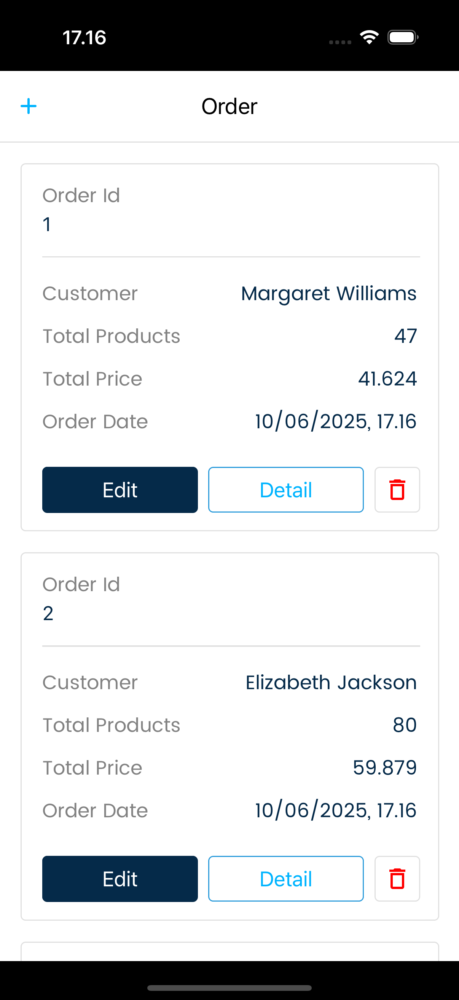

# 📱 Mobile_Rian - React Native App

Aplikasi **Mobile_Rian** adalah aplikasi mobile sederhana berbasis **React Native**, dikembangkan untuk keperluan interview Badr. Aplikasi ini dirancang dengan fokus pada kualitas UI/UX modern, pengambilan data melalui API, dan penggunaan library populer di ekosistem React Native.

---

## 🖼️ Screenshot Aplikasi

  

---

## 🚀 Fitur Utama

- Navigasi stack modern menggunakan `@react-navigation`
- Dropdown input menggunakan `react-native-element-dropdown`
- Menampilkan dan mengambil data menggunakan `axios` & `@tanstack/react-query`
- Notifikasi toast ringan menggunakan `react-native-toast-message`
- Styling responsif dengan `react-native-size-matters` dan `react-native-svg`
- UI reaktif dan aman dengan `SafeAreaView` dan `gesture-handler`
- Optimisasi performa dengan penggunaan `blur`, `safe-area`, dan `screens`

---

## 🛠️ Teknologi dan Library

| Library                            | Deskripsi                                     |
| ---------------------------------- | --------------------------------------------- |
| **React Native 0.77.0**            | Framework utama pengembangan aplikasi mobile  |
| **React 18.3.1**                   | Library UI untuk komponen                     |
| **React Navigation**               | Navigasi antar layar                          |
| **TanStack React Query v5**        | Pengelolaan data async yang efisien           |
| **Axios**                          | Permintaan HTTP ke backend/API                |
| **React Native Toast Message**     | Menampilkan toast notifikasi                  |
| **React Native Element Dropdown**  | Komponen dropdown yang dapat dikustomisasi    |
| **React Native SVG**               | Mendukung grafik vektor (SVG)                 |
| **React Native Safe Area Context** | Menangani tampilan aman pada notch atau bezel |
| **React Native Gesture Handler**   | Gesture yang responsif dan performa tinggi    |
| **React Native Blur**              | Efek blur estetis pada UI                     |

---

## 📦 Minimum Requirements

- Node.js >= 18
- Android Studio atau Xcode (untuk testing di emulator)
- Paket dependencies telah disediakan dalam `package-lock.json`

---

## 🧪 Testing

Testing dilakukan dengan menggunakan **Jest** dan **React Test Renderer**. Konfigurasi unit test sudah disiapkan untuk memastikan kualitas komponen dan logika aplikasi.

---

## 📌 Catatan

- Aplikasi ini bersifat private dan dikembangkan untuk tujuan demonstrasi kemampuan teknis dalam interview.

---

> Dibuat dengan ❤️ menggunakan React Native & TypeScript
